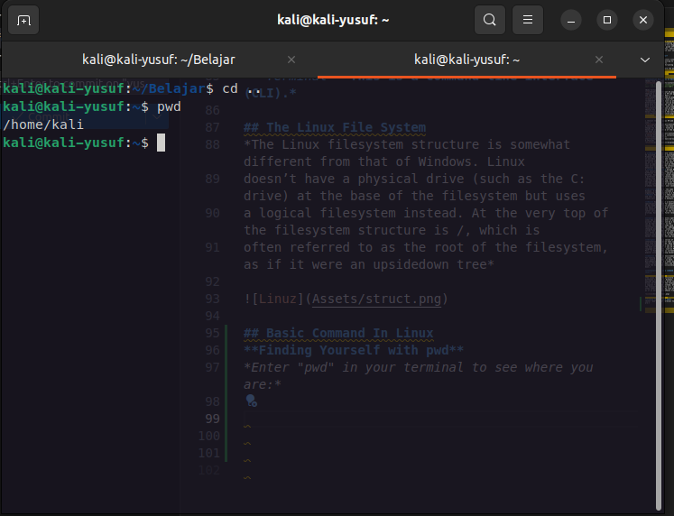
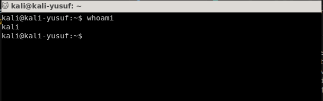

<body>
<p align="center">
  
</p>
<div>This comprehensive guide provides an introduction to Bash scripting and command-line operations. Whether you're a beginner or an experienced user, this guide offers valuable insights into Bash syntax, shell programming, and useful tricks to enhance your command-line productivity.

## Who is this guide for?

- Beginners Learn Directory Linux
- Intermediate users wanting to improve their shell programming skills
- Advanced Automation Scripting

Let's dive in and explore the power of Bash!</div>
# Get Started
*Sebelum Melangkah Ke prakter anda ankan di hadapkan pre requirements*
## pre requirements
### Step 1
**Instalation Kali Linux In Vm**
*Unduh file Iso Linux*

<!--  -->

*Buka Virtual box*

*Specify a name for the VM and provide the path to the ISO image. Select Next.*

*Create a virtual hard disk for the new VM. The recommended hard disk size is at least 25 GB. Alternatively, you can use an existing virtual hard disk file or decide not to add one. Click Next to proceed to the next step.*

*Review the new VM setup on the Summary page. Select Finish to create the virtual machine*

### Step 2
**Configure Virtual Machine Settings and Start VM**

1.*Select the Kali Linux VM and click the Settings icon.*

2.*Select Network from the menu on the left side. Change the Attached to field to Bridged Adapter. Select OK at the bottom of the window to return to the main window.*

3.*Click Start to begin installing Kali Linux.*

4.*Finish*


### GETTING STARTED WITH THE BASICS 
## INTRODUCTORY TERMS AND CONCEPTS

1.***Binaries** This term refers to files that can be executed, similar to executables in
Windows. Binaries generally reside in the /usr/bin or usr/sbin directory and include
utilities such as ps, cat, ls, and cd(we’ll touch on all of four of these in this chapter) as
well as applications such as the wireless hacking tool aircrack­ng and the intrusion
detection system (IDS) Snort.*
2.***Case sensitivity** Unlike Windows, Linux is case sensitive. This means that Desktop is
different from desktop, which is different from DeskTop. Each of these would represent
a different file or directory name. Many people coming from a Windows environment
can find this frustrating. If you get the error message “file or directory not found” and
you are sure the file or directory exists, you probably need to check your case.*

***Directory** This is the same as a folder in Windows. A directory provides a way of
organizing files, usually in a hierarchical manner*
***Home** Each user has their own /home directory, and this is generally where files you
create will be saved by default.*

***Kali** Kali Linux is a distribution of Linux specifically designed for penetration testing.
It has hundreds of tools preinstalled, saving you the hours it would take to download
and install them yourself. I will be using the latest version of Kali at the time of this
writing: Kali 2018.2, first released in April 2018.*

***root** Like nearly every operating system, Linux has an administrator or superuser
account, designed for use by a trusted person who can do nearly anything on the
system. This would include such things as reconfiguring the system, adding users, and
changing passwords. In Linux, that account is called root. As a hacker or pentester, you
will often use the root account to give yourself control over the system. In fact, many
hacker tools require that you use the root account*

***Script** This is a series of commands run in an interpretive environment that converts
each line to source code. Many hacking tools are simply scripts. Scripts can be run with
the bash interpreter or any of the other scripting language interpreters, such as Python,
Perl, or Ruby. Python is currently the most popular interpreter among hackers.*

***Shell** This is an environment and interpreter for running commands in Linux. The
most widely used shell is bash, which stands for Bourne­again shell, but other popular
shells include the C shell and Z shell. I will be using the bash shell exclusively in this
book.*

***Terminal** This is a command line interface (CLI).*

## The Linux File System
*The Linux filesystem structure is somewhat different from that of Windows. Linux
doesn’t have a physical drive (such as the C: drive) at the base of the filesystem but uses
a logical filesystem instead. At the very top of the filesystem structure is /, which is
often referred to as the root of the filesystem, as if it were an upside­down tree*


## Basic Command In Linux
**Finding Yourself with pwd**
*Enter "pwd" in your terminal to see where you are:*
<!--  -->
```bash
pwd
```
*In this case, Linux returned /root, telling me I’m in the root user’s directory. And
because you logged in as root when you started Linux, you should be in the root user’s
directory, too, which is one level below the top of the filesystem structure (/).*

**Checking Your Login with whoami**
<!--  -->
```bash
whoami
```
*If you’ve forgotten whether you’re logged in as root or another user, you can use the
"whoami" command to see which user you’re logged in as*
**Navigating the Linux Filesystem**
*Changing Directories with cd*
```bash
kali >cd/etc
root@kali:/etc#
```
*The prompt changes to root@kali:/etc, indicating that we’re in the /etc directory. We can
confirm this by entering pwd:*
```bash
root@kali:/etc# p
wd
/etc
```
*To move up one level in the file structure (toward the root of the file structure, or /), we
use cdfollowed by double dots (..), as shown here:*
```bash
root@kali:/etc# c
d..
root@kali:/# pw
d
/
root@kali:/#
```
**Listing the Contents of a Directory with ls**
```bash
kali >l
s
bin initrd.img
media
runvar
boot initrd.img.old mntsbinvmlinuz
dev liboptsrvvmlinuz.old
etc lib64proctmp
home lost+found
root
usr
```
*This command lists both the files and directories contained in the directory. You can
also use this command on any particular directory, not just the one you are currently in,
by listing the directory name after the command; for example, ls/etcshows what’s in
the /etc directory.*


